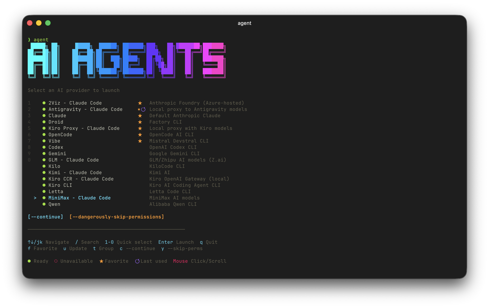

<h1 align="center">Agent CLI</h1>

<p align="center">
  <strong>A beautiful Terminal UI for launching multiple AI providers from a single command</strong>
</p>

<p align="center">
  <a href="https://github.com/galpratama/agent-cli/blob/main/LICENSE"></a>
  <a href="https://www.npmjs.com/package/agent-cli"></a>
  <a href="https://nodejs.org/"></a>
  <a href="https://github.com/galpratama/agent-cli/stargazers"></a>
</p>

<p align="center">
  
</p>

---

## Why Agent CLI?

Managing multiple AI CLI tools is painful. Each provider has its own command, configuration, and environment variables. **Agent CLI** solves this by providing:

- **One command** to rule them all: `agent`
- **Beautiful TUI** with keyboard and mouse support
- **Smart provider switching** with isolated configurations
- **Session history** and usage statistics
- **Auto-fallback** when a provider fails

## Features

- **Multi-Provider Support** - Claude, GLM, Kimi, MiniMax, Codex, Gemini, and more
- **Interactive TUI** - Beautiful interface with gradient colors and ASCII art
- **Keyboard Shortcuts** - Vim-style navigation, quick number selection
- **Mouse Support** - Click to select, double-click to launch, scroll to navigate
- **Provider Validation** - Real-time status checking for all providers
- **Session Management** - Track history, favorites, and usage statistics
- **Saved Profiles** - Quick access to favorite configurations
- **Auto-Fallback** - Automatically try next provider on failure
- **Isolated Configs** - Each provider has its own configuration directory

## Platform Support

| Platform | Status | Notes |
| -------- | ------ | ----- |
| macOS | ✅ Fully Supported | Native support |
| Linux | ✅ Fully Supported | Native support |
| Windows | ✅ Supported via WSL2 | Recommended approach |

### Windows Users (WSL2)

For the best experience on Windows, we recommend using **WSL2** (Windows Subsystem for Linux):

1. **Install WSL2** (if not already installed):
   ```powershell
   # Run in PowerShell as Administrator
   wsl --install
   ```

2. **Install Node.js in WSL2**:
   ```bash
   # Inside WSL2 terminal
   curl -fsSL https://deb.nodesource.com/setup_20.x | sudo -E bash -
   sudo apt-get install -y nodejs
   ```

3. **Clone and install Agent CLI**:
   ```bash
   git clone https://github.com/galpratama/agent-cli.git
   cd agent-cli
   npm install
   npm run link
   ```

4. **Install your AI CLI tools** (e.g., Claude):
   ```bash
   npm install -g @anthropic-ai/claude-code
   ```

> **Why WSL2?** Most AI CLI tools (Claude, Codex, etc.) are designed for Unix-like environments. WSL2 provides the best compatibility and performance on Windows.

### Linux Users

Agent CLI works natively on Linux. Just ensure you have Node.js 18+ installed:

```bash
# Ubuntu/Debian
curl -fsSL https://deb.nodesource.com/setup_20.x | sudo -E bash -
sudo apt-get install -y nodejs

# Fedora
sudo dnf install nodejs

# Arch Linux
sudo pacman -S nodejs npm
```

Then follow the standard installation steps below.

## Quick Start

### Installation

```bash
# Clone the repository
git clone https://github.com/galpratama/agent-cli.git
cd agent-cli

# Install dependencies
npm install

# Build and link globally
npm run link
```

### First Run

```bash
# Launch interactive provider selection
agent

# Or launch a specific provider directly
agent claude
```

## Supported Providers

| Provider      | Type       | Category  | Description                    |
| ------------- | ---------- | --------- | ------------------------------ |
| Claude        | API        | Anthropic | Default Anthropic Claude       |
| Foundry Azure | API        | Anthropic | Azure-hosted Anthropic Foundry |
| GLM           | API        | Chinese   | GLM/Zhipu AI models (Z.ai)     |
| Kimi          | API        | Chinese   | Kimi AI                        |
| MiniMax       | API        | Chinese   | MiniMax AI models              |
| Codex         | Standalone | CLI       | OpenAI Codex CLI               |
| Vibe          | Standalone | CLI       | Mistral Devstral CLI           |
| OpenCode      | Standalone | CLI       | OpenCode AI CLI                |
| Gemini        | Standalone | CLI       | Google Gemini CLI              |
| Kilo          | Standalone | CLI       | KiloCode CLI                   |
| Qwen          | Standalone | CLI       | Alibaba Qwen CLI               |

## Commands

### Interactive Mode

```bash
agent                    # Launch interactive provider selection
agent <provider>         # Launch specific provider directly
agent <provider> "prompt" # Launch with initial prompt
```

### Options

```bash
agent --continue         # Resume last Claude session
agent --dangerously-skip-permissions  # Skip permission prompts
agent --fallback         # Auto-fallback to next provider on failure
```

### Provider Management

```bash
agent list               # List all providers with status
agent check              # Validate all provider configurations
agent providers          # Manage provider configuration
agent providers --config # Show config file path
agent setup [provider]   # Interactive setup wizard
```

### Session Management

```bash
agent last               # Launch last used provider
agent history            # Show session history
agent stats              # Show usage statistics
```

### Profile Management

```bash
agent profile <name>           # Launch saved profile
agent profile-save <name>      # Save new profile
agent profile-save <name> -p claude --continue  # Save with options
agent profile-list             # List saved profiles
agent profile-delete <name>    # Delete profile
```

### Updates

```bash
agent update             # Update agent-cli itself
agent update-tools       # Update all standalone AI CLI tools
agent update-tools gemini # Update specific tool
```

## Keyboard Shortcuts

| Key        | Action                         |
| ---------- | ------------------------------ |
| `↑` / `k`  | Move up                        |
| `↓` / `j`  | Move down                      |
| `Enter`    | Launch selected provider       |
| `/`        | Search providers               |
| `1-9`, `0` | Quick select (1-10)            |
| `f`        | Toggle favorite                |
| `c`        | Toggle --continue mode         |
| `y`        | Toggle --skip-permissions mode |
| `u`        | Update standalone provider     |
| `t`        | Toggle category grouping       |
| `g`        | Go to first item               |
| `G`        | Go to last item                |
| `q`        | Quit                           |

## Mouse Support

- **Click** - Select provider
- **Double-click** - Launch provider
- **Scroll** - Navigate list

## Configuration

### Provider Configuration

Agent CLI stores provider configuration in `~/.agent-cli/providers.json`. You can customize providers, add new ones, or override existing settings.

```bash
# Copy example configuration
cp providers.example.json ~/.agent-cli/providers.json

# Or use the setup wizard
agent setup
```

### Configuration Structure

```json
{
  "$schema": "./providers.schema.json",
  "providers": [
    {
      "id": "claude",
      "name": "Claude",
      "description": "Default Anthropic Claude",
      "icon": "",
      "type": "api",
      "category": "anthropic",
      "configDir": "~/.claude",
      "envVars": {},
      "validation": { "type": "env" }
    }
  ],
  "disabled": [],
  "overrides": {}
}
```

### Provider Properties

| Property      | Type   | Description                                          |
| ------------- | ------ | ---------------------------------------------------- |
| `id`          | string | Unique identifier (lowercase, alphanumeric, hyphens) |
| `name`        | string | Display name                                         |
| `description` | string | Short description                                    |
| `icon`        | string | Emoji/icon for display                               |
| `type`        | string | `api`, `proxy`, `gateway`, or `standalone`           |
| `category`    | string | `anthropic`, `chinese`, `local`, or `standalone`     |
| `configDir`   | string | Configuration directory (supports `~`)               |
| `envVars`     | object | Environment variables to set                         |
| `envMappings` | object | Map source env vars to target env vars               |
| `validation`  | object | Validation configuration                             |
| `command`     | string | Command to run (standalone providers)                |
| `defaultArgs` | array  | Default arguments for command                        |
| `updateCmd`   | array  | Update command for standalone providers              |

### Validation Types

```json
// Check if environment variable is set
{ "type": "env", "envKey": "ANTHROPIC_API_KEY" }

// Check if URL is reachable
{ "type": "http", "url": "https://api.example.com/health" }

// Check if command exists
{ "type": "command", "command": "gemini" }
```

### Environment Variable Mapping

Map your existing environment variables to provider-specific ones:

```json
{
  "envMappings": {
    "Z_AI_API_KEY": "ANTHROPIC_AUTH_TOKEN"
  }
}
```

This maps your `Z_AI_API_KEY` to `ANTHROPIC_AUTH_TOKEN` when launching the provider.

## Provider Setup Guides

### Claude (Default)

Claude works out of the box if you have the Claude CLI installed:

```bash
# Install Claude CLI
npm install -g @anthropic-ai/claude-code

# Authenticate
claude auth
```

### GLM (Z.ai)

```bash
# Set your Z.ai API key
export Z_AI_API_KEY="your-api-key"

# Launch
agent glm
```

### Kimi

```bash
# Set your Kimi API key
export KIMI_API_KEY="your-api-key"

# Launch
agent kimi
```

### MiniMax

```bash
# Set your MiniMax API key
export MINIMAX_API_KEY="your-api-key"

# Launch
agent minimax
```

### Foundry Azure

```bash
# Set your Foundry API key
export ANTHROPIC_FOUNDRY_API_KEY="your-api-key"

# Configure resource name in providers.json
# Launch
agent foundry-azure
```

### Standalone Providers

For standalone providers like Codex, Gemini, etc., install them first:

```bash
# Codex
npm install -g @openai/codex

# Gemini
npm install -g @anthropic-ai/claude-code

# Vibe
npm install -g vibe-cli
```

## Adding Custom Providers

You can add custom providers to your configuration:

```json
{
  "providers": [
    {
      "id": "my-custom-provider",
      "name": "My Custom AI",
      "description": "My custom AI provider",
      "icon": "",
      "type": "api",
      "category": "local",
      "configDir": "~/.my-custom-ai",
      "envVars": {
        "ANTHROPIC_BASE_URL": "https://my-api.example.com"
      },
      "envMappings": {
        "MY_API_KEY": "ANTHROPIC_API_KEY"
      },
      "validation": {
        "type": "env",
        "envKey": "MY_API_KEY"
      }
    }
  ]
}
```

## How It Works

### Provider Isolation

Each provider gets its own configuration directory. This allows you to:

- Have different settings per provider
- Maintain separate conversation histories
- Use different API keys without conflicts

### Credential Management

Agent CLI creates isolated credential storage for each provider, ensuring your API keys and tokens don't conflict between providers.

### Auto-Fallback

When using `--fallback`, if a provider fails (non-zero exit code), Agent CLI automatically tries the next available provider in the same category.

```bash
agent claude --fallback
# If Claude fails, tries next Anthropic provider
```

## Development

```bash
# Clone the repository
git clone https://github.com/galpratama/agent-cli.git
cd agent-cli

# Install dependencies
npm install

# Run in development mode
npm run dev

# Watch mode for TypeScript compilation
npm run watch

# Build for production
npm run build

# Link globally for testing
npm run link
```

### Project Structure

```
agent-cli/
├── src/
│   ├── cli.tsx              # Main CLI entry point
│   ├── components/
│   │   ├── App.tsx          # Main React component
│   │   ├── Header.tsx       # ASCII art header
│   │   ├── Footer.tsx       # Keyboard shortcuts
│   │   ├── ProviderList.tsx # Interactive provider list
│   │   ├── ProviderItem.tsx # Provider list item
│   │   └── StatusBadge.tsx  # Status indicator
│   └── lib/
│       ├── providers.ts     # Provider type definitions
│       ├── provider-config.ts # Configuration management
│       ├── launcher.ts      # Provider launching logic
│       ├── validate.ts      # Provider validation
│       ├── config.ts        # User preferences storage
│       └── useMouse.ts      # Mouse event handling
├── providers.example.json   # Example configuration
├── providers.schema.json    # JSON Schema for validation
└── package.json
```

### Tech Stack

- **React** - UI framework
- **Ink** - React renderer for terminal
- **Commander.js** - CLI argument parsing
- **Chalk** - Terminal styling
- **TypeScript** - Type safety

## Contributing

Contributions are welcome! Please feel free to submit a Pull Request.

1. Fork the repository
2. Create your feature branch (`git checkout -b feature/amazing-feature`)
3. Commit your changes (`git commit -m 'Add some amazing feature'`)
4. Push to the branch (`git push origin feature/amazing-feature`)
5. Open a Pull Request

### Guidelines

- Follow the existing code style
- Add tests for new features
- Update documentation as needed
- Keep commits focused and atomic

## Troubleshooting

### Provider shows as unavailable

1. Check if the required environment variable is set:

   ```bash
   agent check
   ```

2. Verify your API key is correct:

   ```bash
   echo $YOUR_API_KEY
   ```

3. Run the setup wizard:
   ```bash
   agent setup <provider>
   ```

### Command not found after installation

Make sure npm global bin is in your PATH:

```bash
# Add to your shell profile (.bashrc, .zshrc, etc.)
export PATH="$PATH:$(npm config get prefix)/bin"
```

### Provider launches but fails immediately

1. Check if the underlying CLI is installed:

   ```bash
   which claude  # or gemini, codex, etc.
   ```

2. Try running the CLI directly to see error messages:
   ```bash
   claude --help
   ```

### Platform-Specific Issues

#### Linux

**Terminal UI not rendering correctly:**
- Ensure your terminal supports 256 colors: `echo $TERM` should show `xterm-256color` or similar
- Try setting: `export TERM=xterm-256color`

**Permission denied errors:**
```bash
# If npm link fails with permission errors
sudo npm run link
# Or configure npm to use a different directory
npm config set prefix ~/.npm-global
export PATH="$PATH:$HOME/.npm-global/bin"
```

#### Windows (WSL2)

**WSL2 not installed:**
```powershell
# Run in PowerShell as Administrator
wsl --install
# Restart your computer after installation
```

**Node.js not found in WSL2:**
```bash
# Install Node.js in WSL2
curl -fsSL https://deb.nodesource.com/setup_20.x | sudo -E bash -
sudo apt-get install -y nodejs
```

**Cannot access Windows files from WSL2:**
- Windows drives are mounted at `/mnt/c/`, `/mnt/d/`, etc.
- For best performance, clone repositories inside WSL2's filesystem (e.g., `~/projects/`)

**Environment variables not persisting:**
```bash
# Add to ~/.bashrc or ~/.zshrc in WSL2
export YOUR_API_KEY="your-key-here"
source ~/.bashrc
```

## License

MIT License - see [LICENSE](LICENSE) for details.

## Acknowledgments

- [Anthropic](https://anthropic.com) for Claude
- [Ink](https://github.com/vadimdemedes/ink) for the amazing terminal UI framework
- All the AI providers for their excellent APIs

---

<p align="center">
  Made with  by <a href="https://github.com/galpratama">galpratama</a>
</p>
